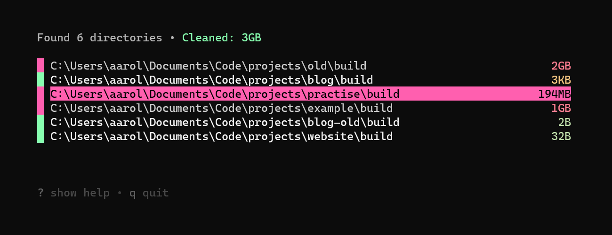

# Goclean

### Clean your filesystem with ease



Goclean is written in Go, using the beautiful [bubbletea](https://github.com/charmbracelet/bubbletea) framework.

--- 

1. Enter the directories you want to find

2. Press <kbd>space</kbd>/<kbd>delete</kbd> to delete the directory

3. Enjoy all the precious bits you saved 

### Reasons to use goclean:

- Get rid of space wasted by old build files

- Quickly delete unused folders

- Compress project files for backups etc.

### Installation

Go 1.17+ is required. [Install go here](https://go.dev/doc/install)

```bash
$ go install github.com/aarol/goclean@latest
```

This should build the program for your system. It should also add it to your $PATH.

## Usage

```bash
$ goclean <dir> (dir2 dir3...)
```

### Options

* `-e`,`--exclude "<dir> (dir2...)"`: Exclude directories from search
* `-a`,`--all`: Include hidden directories (directories starting with ".")
* `--home`: Start search from "$HOME" instead of current working directory
* `-d`,`--debug`: Write debug.log to the current working directory
